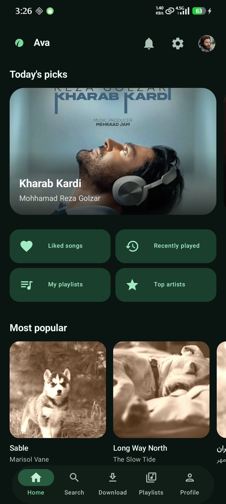
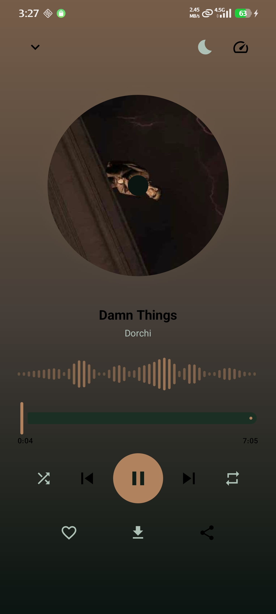
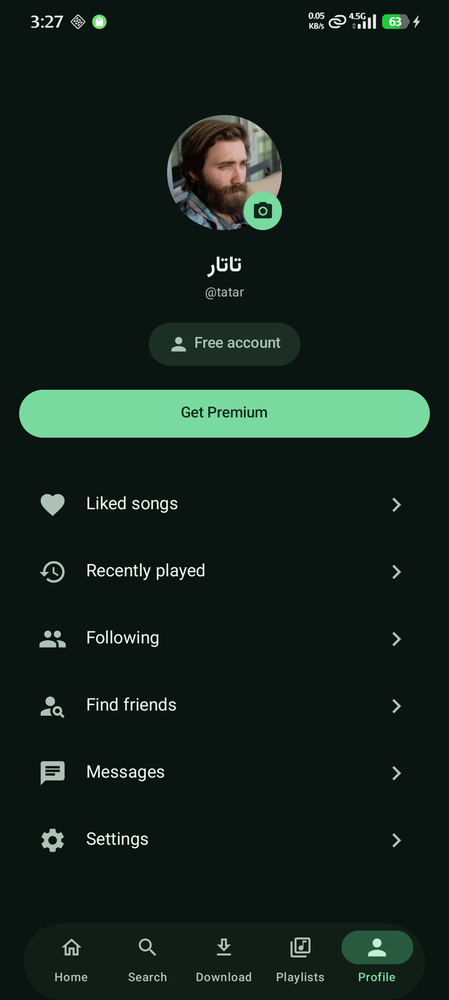
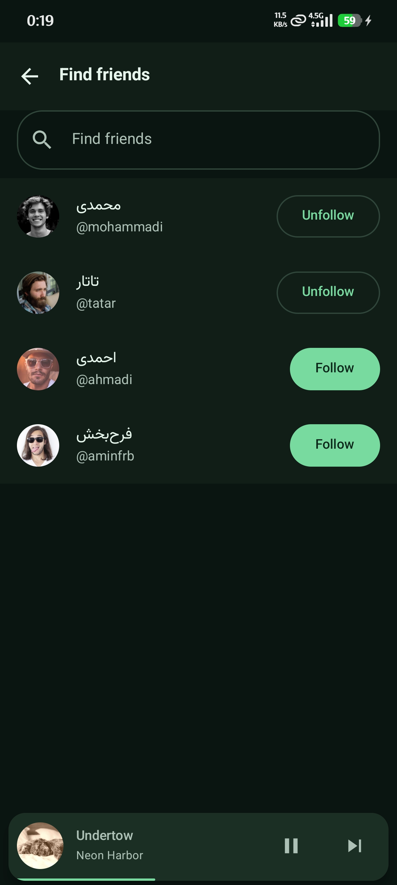
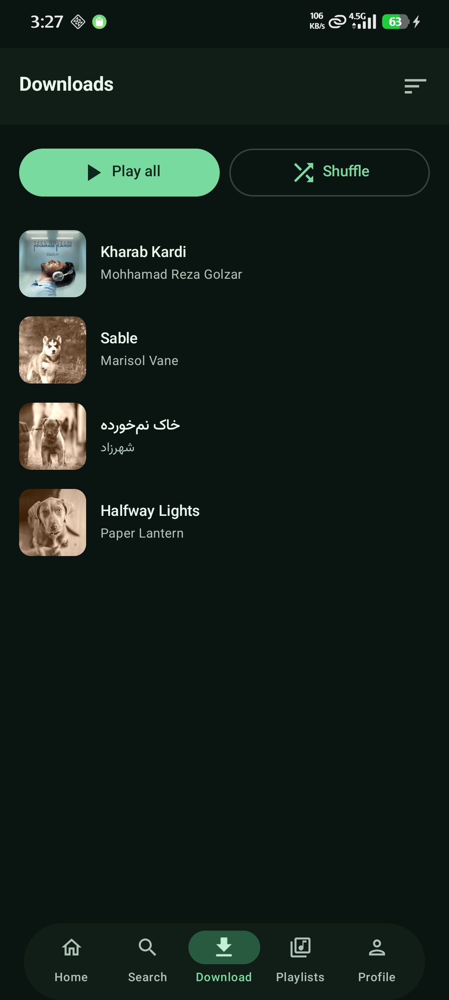
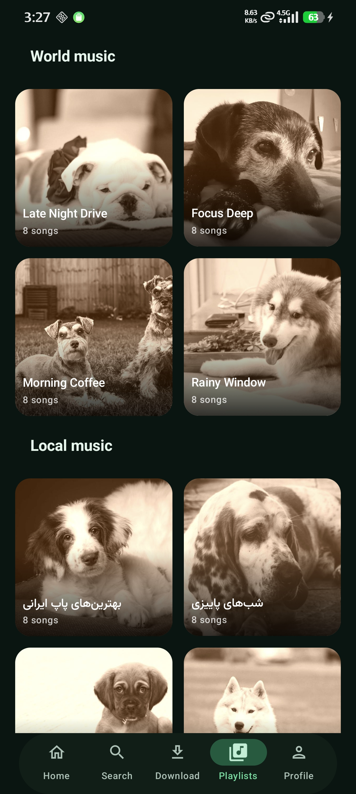

# آوا (Ava) — پلتفرم پخش موسیقی و شبکه اجتماعی

پروژه پایانی درس «برنامه‌نویسی دستگاه‌های سیار» — دانشگاه صنعتی امیرکبیر، بهار ۱۴۰۵

اپلیکیشن اندروید با Jetpack Compose + بک‌اند Node.js. تم سبز، معماری Clean + MVI.

## تصاویری از محیط نرم‌افزار 

<p align="center">
  
  
  
  
  
  
</p>


---

## ۱) اجرای بک‌اند

```bash
cd backend
npm install
npm run seed
npm start
```

حساب دمو: `ali` / `123456` (اشتراک ویژه). کاربران دیگر: `sara`, `nima`, `roya`, `kian`.

برای تست چت بلادرنگ، با دو کاربر مختلف روی دو دستگاه/امولاتور وارد شوید.

## ۲) اجرای اپ اندروید

پوشه `android/` را در Android Studio (Ladybug یا جدیدتر) باز کنید و Sync بزنید.

آدرس سرور در `app/build.gradle.kts` تعریف شده است:

| حالت | مقدار `BASE_URL` |
|---|---|
| امولاتور | `http://10.0.2.2:4000/` (پیش‌فرض) |
| گوشی واقعی | `http://<IP لپ‌تاپ شما>:4000/` |

اگر گوشی واقعی استفاده می‌کنید، IP را در `network_security_config.xml` هم اضافه کنید.

---

## معماری

```
domain/     مدل‌های خالص + اینترفیس ریپازیتوری‌ها   (هیچ وابستگی به اندروید ندارد)
data/       Retrofit + Room + DataStore + socket.io + Paging + پیاده‌سازی ریپازیتوری‌ها
ui/         Compose + ViewModel (UiState + Event + Effect)
player/     MusicService (Media3) + PlayerController
download/   WorkManager
di/         ماژول‌های Hilt
```

جریان داده یک‌طرفه است: `UI → Event → ViewModel → Repository → StateFlow → UI`.
رخدادهای یک‌باره (اسنک‌بار، ناوبری) از `Channel` می‌آیند، نه از `UiState`.

## نگاشت خواسته‌های پروژه به کد

| خواسته | جای پیاده‌سازی |
|---|---|
| دیزاین سیستم (بدون رنگ/فونت هاردکد) | `core/designsystem/theme/` — `Color/Dimens/Shape/Type/Theme.kt` |
| تم روشن و تاریک | `Theme.kt` + `SettingsScreen` |
| دو زبانه + RTL خودکار | `values/strings.xml`، `values-fa/strings.xml`، `LocalLayoutDirection` در `MainActivity` |
| آیکون Adaptive | `res/drawable/ic_launcher_foreground.xml` + `mipmap-anydpi-v26/` |
| Clean Architecture | پوشه‌های `domain` / `data` / `ui` |
| MVI + StateFlow + Channel | همه ViewModelها؛ نمونه شاخص `PlayerViewModel` |
| Hilt | `di/AppModule.kt`، `di/RepositoryModule.kt` |
| Paging 3 | `data/remote/paging/`، `MessageRemoteMediator` (چت) |
| Room | `data/local/` — تاریخچه جستجو، لایک‌ها، مسیر فایل دانلود، پیام‌های آفلاین |
| DataStore | `SettingsStore` (تم/زبان/فونت/اشتراک)، `TokenStore` |
| Shimmer | `core/designsystem/component/Shimmer.kt` |
| Shared Element Transition | `MiniPlayer` ⇄ `NowPlayingScreen`، کلید `cover-<id>` |
| ExoPlayer + MediaSession + نوتیفیکیشن | `player/MusicService.kt` |
| Audio Focus (قطع هنگام تماس) | `setAudioAttributes(..., handleAudioFocus = true)` در `MusicService` |
| کش هوشمند پخش | `player/PlaybackCache.kt` (`CacheDataSource`، ۵۱۲ مگابایت، LRU) |
| Crossfade | `player/CrossfadeController.kt` |
| صفحه پخش: دیسک چرخان | `NowPlayingScreen.SpinningDisc` |
| پس‌زمینه پویا با Palette API | `ui/player/DominantColor.kt` |
| ویژوالایزر با Canvas (بدون Lottie/GIF) | `ui/player/AudioVisualizer.kt` |
| تایمر خواب با کوروتین | `player/SleepTimer.kt` |
| سرعت پخش ۱.۵x / ۲x | `PlayerController.setSpeed` |
| دانلود فقط برای اشتراک ویژه | `DownloadRepositoryImpl.enqueueDownload` (گیت در یک نقطه) |
| دانلود با WorkManager | `download/SongDownloadWorker.kt` |
| پخش هوشمند (فایل لوکال اگر موجود بود) | `Song.playbackUri` در `domain/model/Models.kt` |
| جستجو با debounce | `SearchViewModel` — `debounce(350) + flatMapLatest` |
| Swipe to dismiss | `DownloadsScreen`، `SongListScaffold` |
| چت بلادرنگ با WebSocket (بدون polling) | `data/remote/socket/ChatSocket.kt` + `backend/src/sockets/` |
| تیک ارسال/خوانده‌شدن | `MessageStatus` + `ChatScreen.ReadReceipt` |
| نشانگر «در حال نوشتن» | `ChatViewModel.notifyTyping` |
| اشتراک آهنگ به‌صورت Mini Card | `ChatScreen.MessageBubble` |
| چت آفلاین | `messages` در Room؛ سوکت فقط می‌نویسد، Paging می‌خواند |
| Empty State | `core/designsystem/component/EmptyState.kt` |
| خرید اشتراک (Mock) | `ProfileViewModel.buyPremium` |

## نکته‌ها

- کاربران رایگان همه آهنگ‌ها را بدون محدودیت پخش می‌کنند؛ تنها تفاوت اشتراک ویژه، **دانلود آفلاین** است.
- فایل‌های صوتی seed از SoundHelix (رایگان و بدون کپی‌رایت) می‌آیند. برای محتوای واقعی کافی است
  `AUDIO_POOL` و `cover()` را در `backend/src/data/seed.js` عوض کنید؛ هیچ جای دیگری تغییر نمی‌کند.
- پروژه هنوز روی دستگاه اجرا نشده است. اولین Sync در Android Studio نسخه‌های Gradle/JDK را
  تطبیق می‌دهد؛ اگر خطایی دیدید معمولاً مربوط به JDK 17 یا نبود فونت است.
